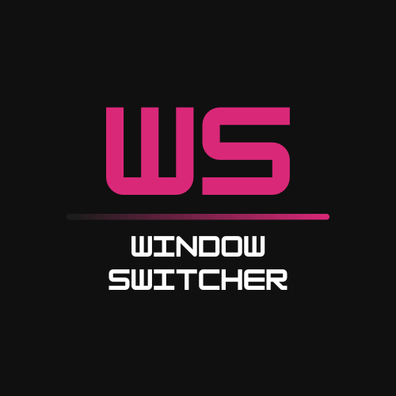
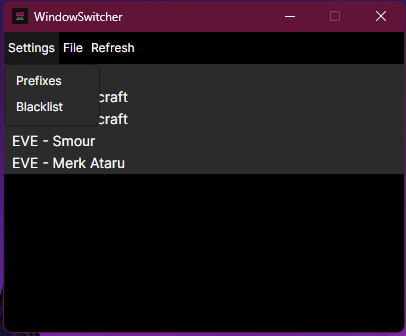
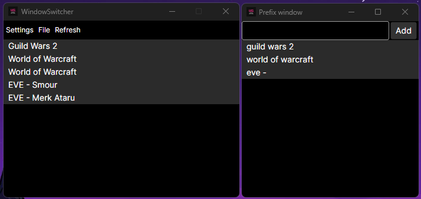
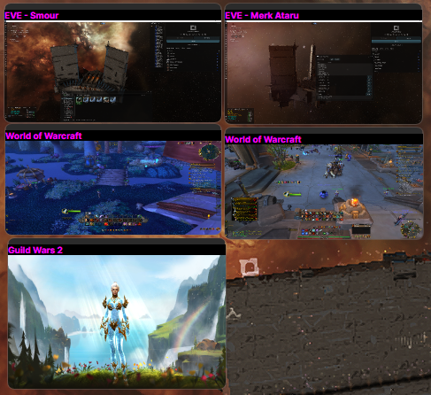

  

# Window Switcher

**Window Switcher** is an **open-source** application that enables users to display **live previews** of selected open windows, with the ability to move, resize, and click to focus windows.

It offers a flexible configuration system based on **prefix-based filters and blacklists**, allowing precise control over which windows are displayed.

This software is inspired by [**eve-o-preview**](https://github.com/EveOPlus/eve-o-preview), but designed for a broader range of use cases.
The primary goal is to provide an **easy and efficient way to multibox** different game clients.

This software **doesn't modify game clients**.

## Main features:
- 🔍 **Live previews** of selected open windows
- ⚙️ **Configurable filters** using prefixes and blacklists
- 🖱️ **Click to focus** the window

## Compatibility
  - ✅ **Windows** (fully supported)
  - 🧪 **Linux X11** (experimental)
  - ❌ **Linux Wayland** (not planned)
  - ⏳ **MacOS** (not yet implemented)

## Limitations
- 🖵 **Fullscreen applications** not supported

## Roadmap
- [x] Windows support
- [x] Basic Linux support (X11)
- [ ] Advanced customization (access settings from the application)
- [ ] MacOS implementation
- [ ] UI enhancements

## Demo v0.1.0

| Main window | Prefix window |
|-----------|-----------|
|  |  |

| Live preview |
|----------- |
|  |

🎥 Example with **Eve Online**, **World of Warcraft** and **Guild Wars 2** clients :

## Installation

Download the latest release [here](https://github.com/SebastienDuruz/Window-Switcher/releases)

### Linux specific dependancies
Make sure your system is able to use the next commands:
- [wmctrl](https://linux.die.net/man/1/wmctrl)
- [export](https://linuxcommand.org/lc3_man_pages/exporth.html)

## Usage
1. Launch Window Switcher.
2. Configure which windows to preview:
3. Prefix filter: Only show windows with specific names.
4. Blacklist filter: Exclude unwanted windows.
5. Adjust the preview size and position.
6. Enjoy !

## License
This project is licensed under the [GPL3 License](LICENSE).

## Donations

If you find **Window Switcher** useful and would like to support its development, consider [buying me a coffee](https://buymeacoffee.com/sebastienduruz) ☕

Your support helps keep this project alive and motivates further improvements. Thank you! 🙌
