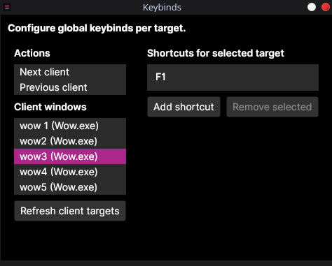
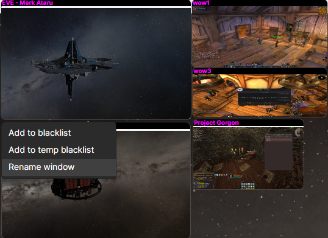
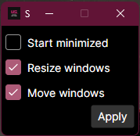
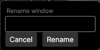

<p align="center">
  
</p>

# Window Switcher

**Window Switcher** is an open-source desktop app that creates small always-on-top preview windows for selected applications and lets you switch between them quickly.

It is designed for multibox and multi-client workflows without modifying the target applications, with support for floating previews, filtering, renaming, diagnostics, and global keybinds.

Inspired by [**eve-o-preview**](https://github.com/EveOPlus/eve-o-preview), the project focuses on broader use cases and cross-platform support.

## What you can do

- Display floating previews for selected windows
- Bring the original window to foreground by clicking a preview
- Trigger a specific client, cycle to the next/previous selected client, or re-focus the active client with global keybinds
- Optionally focus windows on mouse hover
- Filter displayed windows with whitelist prefixes
- Exclude windows with blacklist entries
- Temporarily hide a window for the current session (temp blacklist)
- Rename a window title directly from the UI
- Persist floating window size/position per window
- Tune preview behavior, sizing, decorations, and highlight color from Settings
- Open the app data folder and inspect runtime/OS/dependency status from the About window

## Main areas

- `Filters`: manage whitelist prefixes and blacklist entries.
- `Keybinds`: assign global shortcuts to built-in actions or specific client targets.
- `Settings`: control preview behavior, movement, sizing, decorations, startup mode, and highlight color.
- `Help > About`: inspect runtime information, preview mode, config path, and Linux dependency status.
- `File > Open data folder`: open the persisted application data directory directly.

## Compatibility

- ✅ **Windows**
- ✅ **Linux** (X11 + Wayland)
- ⏳ **macOS** (not implemented)

## Limitations

- 🖵 **Fullscreen applications** not supported
- ⌨️ **Linux global keybinds** require access to `/dev/input/event*` and `/dev/uinput`; previews still work without that access

## How it works

- **Windows:** native DWM thumbnail previews are used in floating windows, and global shortcuts use a low-level keyboard hook.
- **Linux (X11):** screenshots are captured via ImageMagick `import`, and window actions use `wmctrl`.
- **Linux (Wayland):** PipeWire preview is used when dependencies are available; otherwise it falls back to screenshot mode.
- **Linux global keybinds:** evdev devices are read and forwarded back through `uinput`, so matching shortcuts can be intercepted without swallowing unrelated typing.

## Typical workflow

1. Launch Window Switcher.
2. Open `Settings > Filters`, then use the `Prefixes` tab to add whitelist entries.
3. In the same `Filters` window, use the `Blacklist` tab to exclude titles you do not want to see.
4. Floating previews are created for matching windows.
5. Open `Settings > Keybinds` and assign shortcuts to `Next client`, `Previous client`, `Focus active client`, or a specific client target.
6. Click a preview to focus the original window, or enable `Focus on hover`.
7. Right-click a preview (or list item) to blacklist, temp-blacklist, or rename a window.

## Demo

<details open>
  <summary>v0.8.0</summary>

### Features

- Add a window to configure **keybinds**

| Keybinds window                                  |
|--------------------------------------------------|
|  |

🎥 Example with 5 **World of Warcraft** clients, on Arch Linux KDE (Wayland)

[](https://youtu.be/YDAKNa9B7fg)

</details>

<details>
  <summary>v0.7.0</summary>

  🎥 Example with 3 **World of Warcraft** clients, on Arch Linux KDE (Wayland)
  
  [](https://youtu.be/QQTOkl0HD9s)

</details>

<details>
  <summary>v0.4.0</summary>

### Features

- Add a window to configure **settings**
- Add the ability to **rename** windows
    - keep track of different settings for clients like **World of Warcraft**

| Main window                               | Prefix window                                  |
|-------------------------------------------|------------------------------------------------|
|  |  |

| Live preview                                 | Settings / Rename                                                                                |
| -------------------------------------------- | ------------------------------------------------------------------------------------------------ |
|  |   |

🎥 Example with **Eve Online**, **World of Warcraft** and **Project Gorgon** clients :

[](https://youtu.be/hXvS_n32jaQ)

</details>

## Requirements

- Runtime: Windows or Linux
- Source build: .NET SDK 10 (`net10.0`)
- Linux preview/focus features require external tools (see Linux dependencies below)

## Installation

Download the latest release [here](https://github.com/SebastienDuruz/Window-Switcher/releases)

### Quick start

**Windows**

- Download and run the `WindowSwitcher-setup-*.exe` installer from the releases page.

**Linux**

- Download the `*.AppImage` from the releases page.
- Make it executable and run it:
    - `chmod +x WindowSwitcher-*.AppImage`
    - `./WindowSwitcher-*.AppImage`

## Build from source

From the repo root:

- Build: `dotnet build Window-Switcher.slnx`
- Run: `dotnet run --project src/WindowSwitcher/WindowSwitcher.csproj`
- Test: `dotnet test src/WindowSwitcher.Tests/WindowSwitcher.Tests.csproj`

The application version is centralized in `./Directory.Build.props` via `WindowSwitcherVersion`.

Build resources used by packaging now live under:

- `./build/assets/installer/`
- `./build/assets/packaging/linux/`

Generated build outputs now live under:

- `./build/artifacts/`

## Build Artifacts With Nuke

Nuke is now the only build/deploy entrypoint for installer/AppImage packaging.

From the repo root:

- Linux/macOS shell: `./build/build.sh --target <TargetName>`
- Windows cmd: `./build/build.cmd --target <TargetName>`
- Windows PowerShell: `./build/build.cmd --target <TargetName>`

From `./build/` you can also run:

- Linux/macOS shell: `./build.sh --target <TargetName>`
- Windows cmd: `build.cmd --target <TargetName>`
- Windows PowerShell: `./build.cmd --target <TargetName>`

Available targets:

- `Restore`
- `Compile`
- `Installer` (Windows host only)
- `AppImage` (Linux host only)
- `Artifacts` (builds the artifact for the current host OS)

Examples:

- Windows installer (on Windows): `./build/build.cmd --target Installer`
- Linux AppImage (on Linux): `./build/build.sh --target AppImage`

Outputs:

- `./build/artifacts/installer/WindowSwitcher-setup-<version>-<win-runtime>.exe`
- `./build/artifacts/appimage/WindowSwitcher-<version>-<linux-runtime>.AppImage`

Versioning:

- Version is read from `./Directory.Build.props` (`WindowSwitcherVersion`) by default.
- Override for one build with `--version <x.y.z>`.

Important:

- Cross-OS packaging is intentionally disabled.
- `appimagetool` is auto-downloaded to `./build/artifacts/tools/` when missing.

Prerequisites:

- `.NET SDK`
- `NSIS` (`makensis`) for `Installer`

### Linux dependencies

Make sure your system has:

- [`wmctrl`](https://linux.die.net/man/1/wmctrl) (list/focus/rename windows)
- ImageMagick [`import`](https://linux.die.net/man/1/import) (screenshots for live preview)
- [`gst-launch-1.0`](https://gstreamer.freedesktop.org/) + `pipewiresrc` plugin (PipeWire video stream)
- [`pw-dump`](https://pipewire.pages.freedesktop.org/pipewire/page_man_pw-dump_1.html) (PipeWire node discovery and matching)
- [`gdbus`](https://manpages.ubuntu.com/manpages/jammy/man1/gdbus.1.html) (optional, only if portal fallback is enabled)

Install examples (depends on your distro):

- Debian/Ubuntu: `sudo apt install wmctrl imagemagick`
- Arch: `sudo pacman -S wmctrl imagemagick`
- Fedora: `sudo dnf install wmctrl ImageMagick`

Wayland PipeWire packages (examples):

- Debian/Ubuntu: `sudo apt install gstreamer1.0-tools gstreamer1.0-pipewire pipewire-bin libglib2.0-bin`
- Arch: `sudo pacman -S gst-plugin-pipewire gstreamer pipewire glib2`
- Fedora: `sudo dnf install gstreamer1 pipewire-gstreamer pipewire-utils glib2`

## Usage

### Filters behavior

- **Whitelist prefixes:** a window is shown when its title contains at least one configured prefix (case-insensitive).
- **Blacklist:** exact title matches are excluded (case-insensitive).
- **Temp blacklist:** hides a window by ID for the current session only.

### Floating preview behavior

- Drag preview windows when `Move windows` is enabled.
- Resize previews when `Resize windows` is enabled.
- With `Fixed size`, all previews share configured width/height.
- Preview position and size are restored per window key on next launch.
- The active preview highlight is updated when a preview is clicked or activated through a keybind.

### Global keybinds

- Open `Settings > Keybinds` to assign shortcuts to built-in actions or to a specific client window.
- Built-in actions are `Next client`, `Previous client`, and `Focus active client`.
- `Next client` and `Previous client` cycle through the currently selected client set, meaning windows that match the whitelist and are not excluded by the blacklist.
- `Focus active client` brings the currently active client (as tracked by the app) to foreground and focuses it.
- Client targets are populated from currently detected windows, and previously saved targets remain available even when that window is not running yet.
- Duplicate shortcuts on the same target and conflicts across different targets are rejected by the UI.
- On Linux, keybind capture is optional but requires input-device permissions; without them, the app still runs but global shortcuts are unavailable.

### Settings available in-app

- `Disable previews`
- `Resize windows`
- `Move windows`
- `Focus on hover`
- `Start minimized`
- `Window decorations` (Linux policy)
- `Fixed size` + `Width/Height`
- `Highlight color`
- `Apply` is mainly needed when toggling `Disable previews`; other values are persisted as they change

### In-app diagnostics

`Help > About` shows:

- App version
- OS / .NET runtime / architecture
- UI backend
- Config file path
- Active preview mode
- Linux dependency status

## Configuration

Settings are persisted to `config.json` under the app data folder:

- Windows: `%APPDATA%\\WindowSwitcher\\config.json`
- Linux: `~/.config/WindowSwitcher/config.json` (typically)

The file stores:

- UI and preview settings
- Whitelist / blacklist filters
- Saved floating window positions and sizes
- Global keybind target definitions

### Linux global keybind requirements

Global keybinds are optional on Linux, but when you use them the listener needs:

- Read access to `/dev/input/event*`
- Write access to `/dev/uinput` or `/dev/input/uinput`
- Typically: root, membership in the appropriate input group, or custom udev rules

### Error reporting with Sentry

Window Switcher uses [Sentry](https://sentry.io/) for:

- unhandled exception reporting
- a single startup metric

Unhandled exceptions are always reported when Sentry is enabled. A single startup metric is emitted once per application start.

Sentry is configured from the application `config.json` file. There is no in-app setting for it.

Example:

```json
{
  "EnableSentry": true,
  "SentryDsn": "https://examplePublicKey@o0.ingest.sentry.io/0"
}
```

To disable all Sentry traffic, set:

```json
{
  "EnableSentry": false
}
```

You can find the config file path from `Help > About`.

Window Switcher sends only low-cardinality runtime metadata such as:

- OS
- session type
- build channel
- app version
- preview mode
- capture source for unhandled exceptions

Window Switcher does not intentionally send:

- window titles
- process names from your session
- local file paths
- whitelist / blacklist contents
- global keybind definitions
- screenshots or window previews
- shell commands

## License

This project is licensed under the [GPL3 License](LICENSE).

## Donations

If you find **Window Switcher** useful and would like to support its development, consider [buying me a coffee](https://buymeacoffee.com/sebastienduruz) ☕

Your support helps keep this project alive and motivates further improvements. Thank you! 🙌
