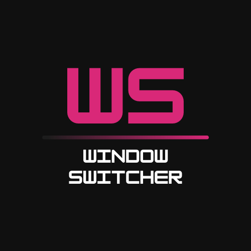
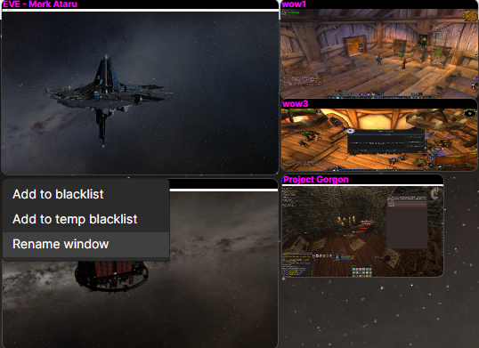
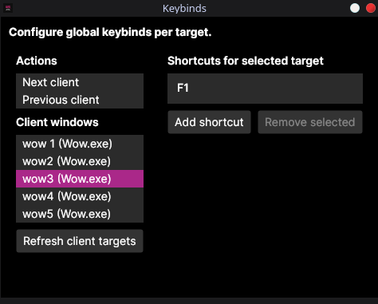
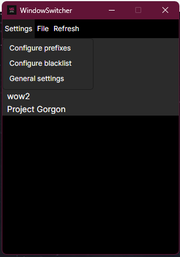
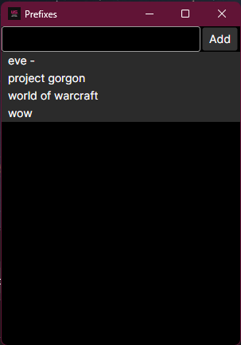
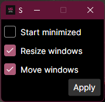
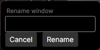

<p align="center">
  
</p>

<h1 align="center">Window Switcher</h1>

<p align="center">
  Keep selected application windows visible as live, always-on-top previews and switch between them in one click or with a global shortcut.
</p>

<p align="center">
  <a href="https://github.com/SebastienDuruz/Window-Switcher/blob/dev/LICENSE"></a>
  
  
</p>

Window Switcher is a cross-platform desktop application for multibox, multi-client, monitoring, and other workflows where several application windows must remain easy to see and activate. It works alongside the target applications and does not modify or inject code into them.

Inspired by [EVE-O Preview](https://github.com/EveOPlus/eve-o-preview), Window Switcher extends the floating-preview approach to broader use cases and to both Windows and Linux.



## Contents

- [Features](#features)
- [Platform support](#platform-support)
- [Installation](#installation)
- [Quick start](#quick-start)
- [User guide](#user-guide)
- [Linux setup](#linux-setup)
- [Configuration and data](#configuration-and-data)
- [Privacy and error reporting](#privacy-and-error-reporting)
- [Troubleshooting](#troubleshooting)
- [Build and contribute](#build-and-contribute)
- [Packaging](#packaging)
- [Demo videos](#demo-videos)

## Features

- Live, always-on-top previews for selected windows
- Click-to-focus and optional focus-on-hover behavior
- Global shortcuts for a specific client, the next or previous client, or the active client
- Case-insensitive title filters for choosing which windows appear
- Persistent and temporary blacklists
- Window renaming from the main list or a preview
- Per-window preview position and size persistence
- Fixed or individually resizable previews
- Configurable movement, startup behavior, and active-window highlight color
- Runtime, operating-system, dependency, preview-mode, and update diagnostics
- Native Windows and Linux implementations—no code injection into monitored applications

## Platform support

| Platform | Window discovery and control | Preview technology | Global shortcuts | Status |
| --- | --- | --- | --- | --- |
| Windows | Native Windows APIs | DWM thumbnails | Low-level keyboard hook | Supported |
| Linux on X11 | Native EWMH | XComposite/XDamage | evdev + `uinput`; permissions required | Supported |
| Linux on Wayland | Native EWMH; **XWayland windows only** | PipeWire through the XDG ScreenCast portal | evdev + `uinput`; permissions required | Partially supported |
| macOS | — | — | — | Not implemented |

### Known limitations

- Native Wayland windows cannot be discovered or switched. Applications running through XWayland, including many Wine/Proton games, can be used.
- Fullscreen applications are not supported.
- Linux global shortcuts are optional and remain unavailable until the user can read `/dev/input/event*` and write to `/dev/uinput` or `/dev/input/uinput`.
- Wayland preview capture may show a desktop portal selection prompt.
- Linux previews use the same 20 FPS target for every window. The active-window highlight does not change capture cadence.

The application still runs when optional preview or keyboard dependencies are unavailable. Open `Help > About` to see the active preview mode and dependency status.

## Installation

Window Switcher is GPL-3.0 software and can always be built from source.

Official precompiled builds are not currently distributed for free. Paid, ready-to-install builds may be offered through channels such as Microsoft Store. Those packages are intended for users who prefer a managed installation and are compiled with Sentry enabled, without a runtime opt-out.

| Operating system | Recommended route |
| --- | --- |
| Windows | Use an official packaged build when available, or [build from source](#build-from-source). |
| Linux | [Install the Linux dependencies](#linux-runtime-dependencies), then [build from source](#build-from-source). |

> [!IMPORTANT]
> Source builds also include Sentry by default. To produce a build without Sentry or any Sentry network traffic, use the [compile-time opt-out](#build-without-sentry).

## Quick start

After installing or building the application:

1. Start the applications or game clients that you want to manage.
2. Launch Window Switcher.
3. Open `Config > Filters` and add part of a window title under **Prefixes**. For example, `World of Warcraft` displays every window whose title contains that text.
4. Add unwanted full window titles under **Blacklist**, if needed.
5. Click a floating preview to bring its original window to the foreground.
6. Optionally open `Config > Keybinds` and assign shortcuts to built-in actions or individual clients.
7. Use `Config > Settings` to adjust preview movement, sizing, hover focus, startup behavior, and highlight color.

The main window refreshes its matching-window list automatically. Preview windows are created and removed as matching applications open and close.

## User guide

### Select windows with filters

Window Switcher uses window titles to decide what appears:

- **Prefixes (whitelist):** a window appears when its title contains at least one configured value. Matching is case-insensitive.
- **Blacklist:** a window is excluded when its complete title matches a configured value. Matching is case-insensitive.
- **Temporary blacklist:** a window is hidden by its current window ID until Window Switcher is restarted.

Open `Config > Filters` to manage the persistent lists. Selecting an existing entry removes it.

You can also right-click a window in the main list or its preview to:

- add its title to the blacklist;
- add it to the temporary blacklist; or
- rename the original window.

Renaming is especially useful when several clients initially share the same title. It also gives each client a stable, recognizable preview and keybind target.

### Arrange floating previews

- Enable **Move windows** to drag previews.
- Enable **Resize windows** to resize previews individually.
- Enable **Fixed size** to use the configured width and height for every preview.
- Enable **Focus on hover** to activate a client by moving the pointer over its preview.
- Enable **Enable previews** to show live content inside floating windows.
- Choose **Highlight color** to change the active-preview outline.

Position and size are saved per window key and restored on a later launch. Use `File > Clean config` to clear saved preview layouts without resetting every preference.

The highlight follows the client activated through a preview or global keybind, making the currently active target easy to identify.

On Wayland, use `Config > Reset all previews` if you need to discard existing portal capture selections and choose them again. This command is shown only when the active preview provider supports selection reset.

### Configure global keybinds

Open `Config > Keybinds`, select a target, and choose **Add shortcut**.

Built-in targets are:

| Target | Behavior |
| --- | --- |
| `Next client` | Cycles forward through windows currently selected by the filters. |
| `Previous client` | Cycles backward through the selected windows. |
| `Focus active client` | Brings the client currently tracked as active back to the foreground. |

You can also bind shortcuts directly to an individual client. Running windows are offered as client targets, while saved targets remain available when their window is not currently open.

The keybind editor rejects duplicate shortcuts on one target and conflicts between different targets. On Linux, it also displays setup guidance when input-device permissions are missing.



### Settings reference

| Setting | Purpose |
| --- | --- |
| `Move windows` | Allows floating previews to be dragged. |
| `Focus on hover` | Focuses a client when the pointer enters its preview. |
| `Enable previews` | Enables live content in floating preview windows. |
| `Start minimized` | Starts the main window hidden in the system tray. |
| `Resize windows` | Allows previews to be resized individually. |
| `Fixed size` | Applies one width and height to all previews. |
| `Width` / `Height` | Sets the fixed preview dimensions, from 10 to 2000 pixels. |
| `Highlight color` | Sets the outline color for the active preview. |

Settings are persisted as they change.

### Main menu reference

| Menu | Command | Purpose |
| --- | --- | --- |
| `Config` | `Filters` | Manage whitelist and blacklist entries. |
| `Config` | `Keybinds` | Configure global shortcuts. |
| `Config` | `Settings` | Configure preview behavior and appearance. |
| `Config` | `Reset all previews` | Reset supported capture selections, primarily on Wayland. |
| `File` | `Open logs` | Open the directory containing the application log files. |
| `File` | `Open config` | Open the directory containing `config.json`. |
| `File` | `Clean config` | Remove saved preview positions and sizes. |
| `File` | `Generate new config` | Restore all settings to their defaults. |
| `Help` | `About` | Show diagnostics, version information, and updates. |

### Diagnostics and updates

Open `Help > About` to view:

- the application version and update status;
- an update action when a newer release is available;
- the operating system, .NET runtime, and process architecture;
- the active Avalonia UI backend;
- the exact configuration-file path;
- the active preview mode; and
- Linux dependency status.

On Linux, the capability diagnostic distinguishes the detected session, the selected preview
backend, and its availability. For Wayland it reports separately whether the system PipeWire
runtime (`libpipewire-0.3.so.0`) or the bundled Window Switcher adapter
(`libwindowswitcher-pipewire.so`) is missing. Diagnostics never cause an X11/Wayland backend
fallback.

Source and directly distributed builds use the GitHub release updater. Builds labelled for Microsoft Store report that updates are managed by the store instead.

## Linux setup

Window Switcher supports Linux on x86-64 systems through the `linux-x64` runtime. Linux ARM64 is not supported.

### Linux runtime dependencies

Window discovery, focus, and renaming use the X11 EWMH protocol directly. Wayland previews also require PipeWire and an XDG Desktop Portal ScreenCast backend suitable for the desktop environment.

| Distribution | Wayland preview runtime |
| --- | --- |
| Debian / Ubuntu | `sudo apt install libpipewire-0.3-0 xdg-desktop-portal` |
| Arch Linux | `sudo pacman -S pipewire xdg-desktop-portal` |
| Fedora | `sudo dnf install pipewire-libs xdg-desktop-portal` |

Package names and portal backends vary by distribution and desktop environment. KDE commonly uses `xdg-desktop-portal-kde`, while GNOME commonly uses `xdg-desktop-portal-gnome` in addition to the base portal package.

On Wayland, EWMH can enumerate only XWayland windows. Installing more portal packages does not enable native Wayland window discovery.

### Linux preview rendering

PipeWire previews attempt to import DMA-BUF frames directly into EGL for zero-copy GPU rendering.
This path requires Avalonia to start with its EGL/X11 renderer and a compatible EGL driver. Set
`EGL_PLATFORM=x11` in the launcher or development run configuration **before** starting the
process. Window Switcher does not restart itself or create a child process to apply this setting.

If EGL or DMA-BUF import is unavailable, the application remains usable and automatically falls
back to CPU-backed preview frames. This fallback affects the transfer path, not the uniform 20 FPS
target.

### Linux build dependencies

Building from source on Linux additionally requires:

- .NET SDK 10;
- a C compiler with C17 support;
- `pkg-config`; and
- PipeWire development headers.

Typical development-header packages are `libpipewire-0.3-dev` on Debian/Ubuntu, `pipewire` on Arch Linux, and `pipewire-devel` on Fedora. The native PipeWire capture adapter is built with the application and included in published and AppImage outputs.

### Linux global-keyboard permissions

For global shortcuts, Window Switcher must be able to:

- read the keyboard devices under `/dev/input/event*`; and
- write forwarded events to `/dev/uinput` or `/dev/input/uinput`.

The in-app keybind screen recommends the following command on distributions that use the `input` group:

```bash
sudo usermod -aG input "$USER"
```

Sign out and back in after changing group membership, then restart Window Switcher. Some distributions require custom `udev` rules instead. The `uinput` kernel module must also be loaded and the device node must be writable.

These permissions grant access to low-level input devices. Review your distribution's security guidance before enabling them. Previews and click-to-focus continue to work without global-keyboard access.

The Linux listener reads evdev events and forwards them through `uinput`, allowing matching shortcuts to be intercepted without swallowing unrelated keyboard input. Modifier keys are always forwarded immediately; only the primary key of a matched shortcut is intercepted, so holding Alt or Meta for a shortcut may still be seen by the desktop as a standalone modifier tap.

## Configuration and data

Preferences are stored in `config.json` inside the application data directory:

| Platform | Default path |
| --- | --- |
| Windows | `%APPDATA%\WindowSwitcher\config.json` |
| Linux | `~/.config/WindowSwitcher/config.json` in a typical desktop session |

Use `File > Open config` to open the exact directory for the current system.

The file contains:

- preview and UI preferences;
- whitelist and blacklist entries;
- saved preview positions and sizes;
- global keybind targets and shortcuts;
- an anonymous telemetry installation ID; and
- an optional Sentry DSN override for custom builds.

Prefer the in-app controls for routine changes. If you edit `config.json` manually, close Window Switcher first and keep a backup. When the configuration is invalid or unreadable, it is renamed to `config.json.unreadable-<timestamp>` in the same folder and defaults are used so that the application can start. If the file cannot be renamed, it is left untouched and changes are not saved until the next launch.

## Privacy and error reporting

Window Switcher uses [Sentry](https://sentry.io/) for unhandled-exception reporting and one low-frequency startup metric. Sentry is enabled at compile time by default; builds that include it do not provide a runtime switch to disable it. A Sentry network failure does not prevent the application from running.

The emitted startup metric is:

- `window_switcher.app_started`

Sentry events may contain the following limited runtime metadata:

- anonymous installation ID, used as Sentry `User.Id` and as `telemetry_installation_id` on the startup metric;
- telemetry schema version;
- operating system, process architecture, and session type;
- build channel, distribution channel, and package kind;
- application version and preview mode;
- a sanitized capture source for unhandled exceptions; and
- breadcrumbs listing the application log messages that preceded a crash. A breadcrumb contains only the message template (for example `PipeWire portal request timed out`), the emitting component, the level, and the exception type, never the logged values.

Handled errors are never sent to Sentry as events; they are only written to the local log described below.

Window Switcher does **not intentionally send**:

- window titles or process names from the user's session;
- local file paths;
- whitelist or blacklist contents;
- global keybind definitions;
- screenshots or window previews;
- shell commands; or
- hostnames, usernames, email addresses, or machine-derived identifiers.

The `SentryDsn` value in `config.json` can redirect events for a custom build, but it is not an opt-out. Builds compiled without Sentry ignore this setting entirely.

### Local logs

Window Switcher writes a rolling log file on the local machine. It is never uploaded; attach it to an issue yourself when reporting a problem. Use **File > Open logs** to open the log folder (**File > Open config** opens the folder that contains `config.json`).

| Platform | Folder |
| --- | --- |
| Linux | `$XDG_STATE_HOME/WindowSwitcher/logs/` (defaults to `~/.local/state/WindowSwitcher/logs/`) |
| Windows | `%LOCALAPPDATA%\WindowSwitcher\logs\` |

A new file `window-switcher-<yyyyMMdd>.log` is started every day or when it reaches 10 MB, and only the 7 most recent files are kept. Identical messages are written at most once every 30 seconds. Logs contain the application version, platform details, component errors with their stack traces, window or process identifiers, and device paths; they do not contain window titles or keystrokes.

### Build without Sentry

Use the option that matches the build entry point:

```powershell
# Direct MSBuild / dotnet
dotnet build Window-Switcher.slnx -p:EnableSentryTelemetry=false
```

```bash
# Make
make build SENTRY_TELEMETRY=false

# Packaging build
./build/build.sh --target AppImage --enable-sentry-telemetry false
```

On Windows, the equivalent packaging option is:

```powershell
./build/build.cmd --target Installer --enable-sentry-telemetry false
```

## Troubleshooting

### No windows appear

1. Confirm that at least one non-empty entry exists under `Config > Filters > Prefixes`.
2. Check that the window title contains that entry and is not an exact blacklist match.
3. On Linux, confirm that the desktop window manager exposes the EWMH `_NET_CLIENT_LIST` property and that the target is an X11 or XWayland window.
4. On Wayland, confirm that the target application is using XWayland. Native Wayland windows are not discoverable.

### A preview is blank or unavailable

- Confirm that **Enable previews** is enabled.
- Fullscreen applications are not supported; try windowed or borderless-windowed mode.
- On X11, confirm that compositing and the XComposite/XDamage extensions are available.
- On Wayland, install PipeWire and the appropriate XDG Desktop Portal backend, then accept the portal selection prompt.
- Open `Help > About` and review **Preview mode** and **Dependency status**.
- On Wayland, try `Config > Reset all previews` and select the capture source again.

### Global shortcuts do not work on Linux

- Open `Config > Keybinds` and follow the permission banner.
- Confirm read access to `/dev/input/event*` and write access to `/dev/uinput`.
- Confirm that the `uinput` kernel module is loaded.
- Sign out and back in after adding the user to the `input` group.

### A preview opens in the wrong place or size

Use `File > Clean config` to remove saved preview positions and sizes, then arrange the previews again.

### Reset all preferences

Use `File > Generate new config`. This restores default settings, filters, saved layouts, and keybind definitions.

When reporting a reproducible problem, include the application version and the non-sensitive diagnostic information shown under `Help > About`. Do not post `config.json` publicly without reviewing it first.

## Build and contribute

### Build from source

Prerequisites:

- [Git](https://git-scm.com/)
- [.NET SDK 10](https://dotnet.microsoft.com/download/dotnet/10.0)
- the [Linux build dependencies](#linux-build-dependencies), when building on Linux

Clone and run:

```bash
git clone https://github.com/SebastienDuruz/Window-Switcher.git
cd Window-Switcher
dotnet restore Window-Switcher.slnx
dotnet run --project src/WindowSwitcher/WindowSwitcher.csproj
```

On Linux, launch with EGL selected before process startup to enable the PipeWire DMA-BUF
zero-copy path:

```bash
EGL_PLATFORM=x11 dotnet run --project src/WindowSwitcher/WindowSwitcher.csproj
```

For Rider, add `EGL_PLATFORM=x11` to the **Environment variables** field of the WindowSwitcher
Run/Debug configuration. The application uses a normal single-process startup and does not alter
the IDE diagnostics or debugger environment.

The standard source build includes Sentry. Add `-p:EnableSentryTelemetry=false` to the `dotnet restore`, `build`, or `run` command when a Sentry-free build is required.

### Repository structure

```text
Window-Switcher/
├── src/WindowSwitcher/          Avalonia desktop UI
├── src/WindowSwitcher.Lib/      Platform and application services
├── src/WindowSwitcher.Tests/    Unit and integration tests
├── build/                       C# packaging build project
├── docs/                        Screenshots and documentation assets
├── Directory.Build.props        Shared version and build properties
├── Makefile                     Common development commands
└── Window-Switcher.slnx         .NET solution
```

The application targets `net10.0` and uses Avalonia with CommunityToolkit.Mvvm. Operating-system interactions are isolated in `WindowSwitcher.Lib`; the UI and ViewModels must remain platform-agnostic.

### Development commands

Run commands from the repository root:

| Make command | Direct .NET equivalent | Purpose |
| --- | --- | --- |
| `make restore` | `dotnet restore Window-Switcher.slnx` + `dotnet tool restore` | Restore packages and local tools. |
| `make build` | `dotnet build Window-Switcher.slnx` | Build the solution. |
| `make run` | `dotnet run --project src/WindowSwitcher/WindowSwitcher.csproj` | Run the desktop application. |
| `make test` | `dotnet test src/WindowSwitcher.Tests/WindowSwitcher.Tests.csproj` | Run all tests. |
| `make test-no-build` | `dotnet test src/WindowSwitcher.Tests/WindowSwitcher.Tests.csproj --no-build` | Run tests without rebuilding. |
| `make clean` | `dotnet clean Window-Switcher.slnx` | Clean build outputs. |
| `make format` | `dotnet csharpier format .` | Format the repository. |
| `make format-check` | `dotnet csharpier check .` | Check formatting without changing files. |
| `make appimage` | `./build/build.sh --target AppImage` | Build the AppImage on Linux. |
| `make installer` | `./build/build.sh --target Installer` | Build the Windows installer (requires `makensis`). |
| `make artifacts` | `./build/build.sh --target Artifacts` | Build every artifact the current host supports. |

The application version is defined once as `WindowSwitcherVersion` in `Directory.Build.props`.

### Contributing

Contributions and focused bug reports are welcome:

1. Search the [existing issues](https://github.com/SebastienDuruz/Window-Switcher/issues).
2. Open an issue for significant behavioral or architectural changes before investing in a large implementation.
3. Keep changes small and focused, and add tests for business logic.
4. Run `dotnet build Window-Switcher.slnx` and `dotnet test src/WindowSwitcher.Tests/WindowSwitcher.Tests.csproj`.
5. Run `dotnet csharpier check .` before submitting a pull request.

All contributions must follow the engineering rules in [`AGENTS.md`](AGENTS.md), including the MVVM boundaries, asynchronous-programming requirements, nullability rules, and XML documentation for public library APIs.

## Packaging

The release artifacts are produced by a small C# console project in `build/` (`_build.csproj`), started through `build/build.sh` on Linux and `build/build.cmd` on Windows. It has no build framework dependency: each target runs its dependencies first, then itself. A Linux host builds both the AppImage and the Windows installer; a Windows host builds the installer only, because the AppImage needs a Linux toolchain (PipeWire native library, `appimagetool`). Targets the current host cannot build are skipped.

### Targets

| Target | Host | Output |
| --- | --- | --- |
| `Restore` | Windows or Linux | Restored project dependencies |
| `Compile` | Windows or Linux | Compiled application |
| `Installer` | Windows or Linux | `build/artifacts/installer/WindowSwitcher-setup-<version>-<x86_64\|arm64>.exe` |
| `AppImage` | Linux | `build/artifacts/appimage/WindowSwitcher-<version>-x86_64.AppImage` and matching `.AppImage.zsync` |
| `Artifacts` | Windows or Linux | Installer and, on Linux, AppImage (default target) |

### Commands

```powershell
# Windows installer
./build/build.cmd --target Installer

# Windows Store-labelled compile
./build/build.cmd --target Compile --distribution-channel windows_store --package-kind store
```

```bash
# Linux AppImage
./build/build.sh --target AppImage

# Windows installer, built from Linux
./build/build.sh --target Installer

# AppImage and Windows installer
./build/build.sh --target Artifacts

# List targets and options
./build/build.sh --help
```

Useful options:

- `--version <x.y.z>` overrides `WindowSwitcherVersion` for one build.
- `--enable-sentry-telemetry false` excludes Sentry.
- `--distribution-channel <name>` and `--package-kind <name>` label packaged builds.
- `--makensis-path <path>` selects a specific NSIS compiler.
- `--self-contained false` publishes a framework-dependent build that requires the .NET 10 runtime on the target machine. Packaged builds are self-contained by default, and the AppImage target rejects framework-dependent output.

The installer target uses `makensis` from `PATH`. On Windows it falls back to the restored NSIS NuGet package; on Linux, install the distribution `nsis` package (the NuGet package is not restored on non-Windows hosts). When the Windows installer is built on Linux, the Linux-only PipeWire native library is excluded from the Windows publish output. The AppImage target downloads the current tool from the [`AppImage/appimagetool`](https://github.com/AppImage/appimagetool) release stream to `build/artifacts/tools/`; use `--app-image-tool-path` only to select an explicit tool. This modern tool embeds the current Type 2 AppImage runtime and GitHub Releases update information for AppImageUpdate-compatible delta updates.

Publish both the versioned `.AppImage` and its matching `.AppImage.zsync` as GitHub Release assets. The embedded `gh-releases-zsync` feed resolves the latest stable release using the `WindowSwitcher-*-x86_64.AppImage.zsync` asset pattern.

Build-labelled `windows_store` packages use store-managed updates instead of the GitHub release updater. Packaging resources live under `build/assets/installer/` and `build/assets/packaging/linux/`; generated artifacts remain under `build/artifacts/`.

## Demo videos

- [Five World of Warcraft clients on Arch Linux KDE Wayland (v0.8.0)](https://youtu.be/YDAKNa9B7fg)
- [Three World of Warcraft clients on Arch Linux KDE Wayland (v0.7.0)](https://youtu.be/QQTOkl0HD9s)
- [EVE Online, World of Warcraft, and Project Gorgon clients (v0.4.0)](https://youtu.be/hXvS_n32jaQ)

<details>
<summary>Older interface screenshots</summary>

| Main window | Filters |
| --- | --- |
|  |  |

| Settings | Rename window |
| --- | --- |
|  |  |

</details>

## License and support

Window Switcher is licensed under the [GNU General Public License v3.0](LICENSE).

If the project is useful to you, you can support its continued development by [buying the maintainer a coffee](https://buymeacoffee.com/sebastienduruz).
